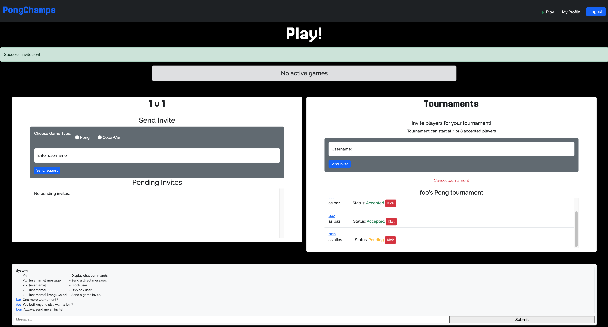
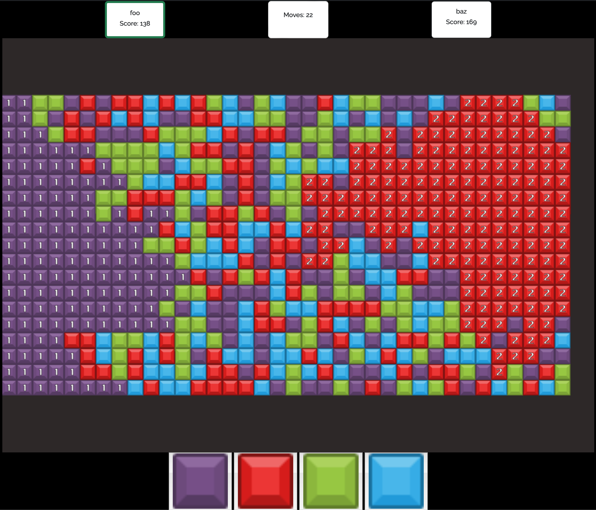
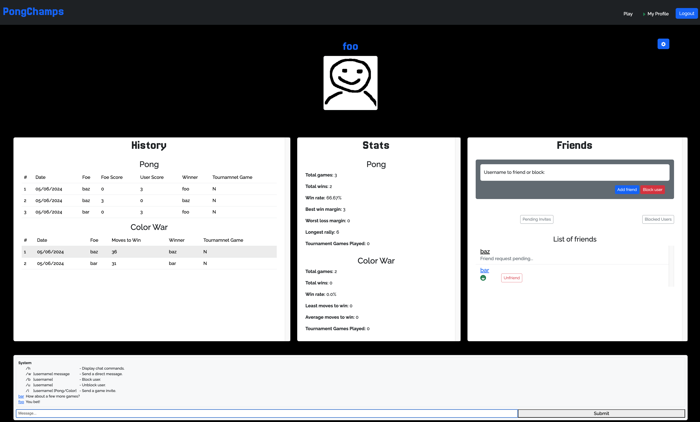

# ft_transcendence - A Multiplayer Game Platform Webapp
*This project was developed as part of the School 42 curriculum at Hive Helsinki*
*42 students, please note that this project complies with subject version `14.1`*

## Description
This project focuses on creating a web platform for multiplayer games.
Users can chat, view and manage profiles and participate in two different games via real-time matches and tournaments.
Utilizing a single-page architecture, the application combines multiple technologies to provide a responsive user experience. Deployment is facilitated through Docker containers, allowing for easy development, setup and management.



## Technologies
* [PostgreSQL](https://www.postgresql.org/) - Relational database
* [Docker](https://www.docker.com/) - Virtualization platform
* [Django](https://www.djangoproject.com) - Backend framework
* [Nginx](https://nginx.org/en/) - Web server


## Features / Modules
### Core
* A single-page application
* Frontend written in pure vanilla JavaScript
* Users can play Pong in 1v1 games and tournaments
* Written with security in mind
	* Utilizes HTTPS for all connections
	* Passwords are hashed
	* Protected against XSS and SQL injections
### Django as a Backend Framework
* The backend is written in Django
* Running in its' designated container
* Leveraging it's capabilities as thoroughly as possible (designing models, HTML templating...)
### PostgreSQL as a Database for Backend
* Django is configured to use Postgres as its storage method
	* The database is running in a separate container
* Utilizing the Object-Relational Mapping for efficiency and safety
### Bootstrap as Frontend Framework
* The frontend utilizes Bootstrap for a responsive, consistent and visually appealing look
* The Bootstrap is written into both the index.html and the templated HTML content served from Django
### Standard User Management
* Registering to the website
* Modidying their account
	* General information
	* Uploading profile pictures
* Viewing the profiles of other users
* Friend management system
	* Viewing online status
	* Blocking
* Game history & Statistics
### Another Game
* ColorWar
	* A turn-based game of conquering the majority of a color grid
* Developed to utilize the the same systems as Pong
	* Avoiding redundancy and writing scalable multi-purpose solutions
### Live Chat
* A real-time chat utilizing WebSocket connectivity
* Site-wide and Direct Message communication
* Usage of other features directly from the chat
	* Game invites
	* Blocking users
	* Announcing game invites, tournament updates and results
	* Accessing user profiles
### Advanced 3D Graphics
* Impoving the game experience by adding 3D graphics utilizing ThreeJS
* Rotating the camera around the game field
### Server-Side Game Logic
* The logic for each game is running on its own server, in a designated container
* Servers handling multiple instances of active games simultaneously
* Responsive and smooth server-client performance
* Command-Line Interface
	* Users can see the real-time data of active games from the terminal
	* Searching users and fetching their data from the terminal



## Lessons Learned
### Project Management
* Defining the Minimum Viable Product
	* Agreeing on what the the end product should include and be like
	* Choosing a set of features and sticking to them
* Splitting large tasks into smaller ones
	* Delegation skills
* Time management
	* Setting timelines
	* Asking for help when it is needed
	* Checking up on colleagues if they need a hand
* Project Management tools
	* Jira
	* Figma
### Teamwork and Collaboration
* Effective Communication
	* Weekly meetings
	* Keeping up with my colleagues
	* Clear comments and commit messages
* Sharing knowledge
	* There was something new here for everyone
* Supporting each other and celebrating successes
### Technical Skills Enhancement
* Hands-on experience with new programming languages and technologies
* Continuous learning
* Code reviews and feedback



## System Requirements
* Docker
* Docker-compose

## Installation & Usage
1. Clone this repository to your local machine:

   ```bash
   git clone https://github.com/tikanoja/ft_transcendence.git ft_transcendence &&
   cd ft_transcendence
   ```
2. Set up the `.env`. Choose you desired values for the variables in `env.template` and rename it to `.env`. Example:

   ```
	POSTGRES_DB=mydb
	POSTGRES_USER=myuser
	POSTGRES_PASSWORD=mypassword

	DJANGO_SECRET_KEY=asdgoihgsadogh8is105
   ```
3. Ensure that your Docker is running and build the project.

   ```bash
   make
   ```
4. Access the webapp at `https://localhost`

Please see Makefile rules for futher options.